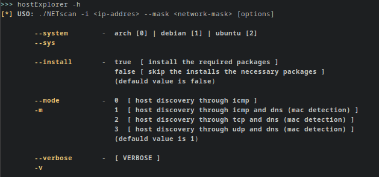

  <h1>hostExplorer_V2</h1>
  <h4>Esta herramienta esta creada con el fin de poder realizar escaneos de red</h4>

<ul>
    <li>Esta herramienta cuneta con funciones, que permiten obtener IP, hostname, MAC, etc de los equipos detectados en la red.</li>
</ul> 

Ejemplo de escaneo
======
div align="center">
  

Instalacion automatica
======

    curl -O https://raw.githubusercontent.com/clhore/hostExplorer_V2/main/hostExplorer && sudo chmod +x hostExplorer
    sudo ./hostExplorer --install=true

Instalacion manual
======
Intalar las librerias de python: 

    pip3 install ipaddress
    pip3 install tabulate
    pip3 install icmplib
    pip3 install python3-nmap
    
    
Help Panel
======

  

